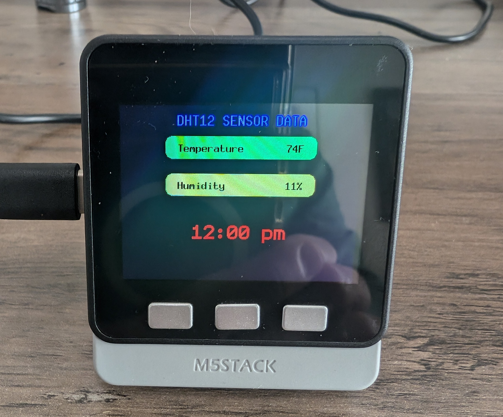

# Rust M5Stack embassy, embedded-graphics, DHT12 sensor

This demo shows the DHT12 temperature and humidity readings on the M5Stack display. The application is programmed in Rust and uses embassy (no_std) and embedded-graphics(EG).

## Development Board
M5Stack Basic Core (no psram) with the BTC base which includes the DHT12 sensor.
The DHT12 is not a very good sensor for humidity measurement and the temperature measurement is higher than the actual ambient temperature by about 6 degrees Fahrenheit.

## Acknowledgements
First and foremost I would like to acknowledge two people and the work they have done.  Without their work to learn from I don't think I would have been able to produce this demo.

For the Ili9341-async code I used https://github.com/yuri91/ili9341-rs/tree/master works for guidance.

For framebuffer implementation I used https://github.com/inazarenko/ssd1331-async/tree/b3006ad955dfc83100527a56d7c06d775ac3bb69 works with minor modifications.  This respository was a game changer and I loved his implementation because the framebuffer did not need to be the size of the display ie the display width times display height times bytes per pixel color.

## no_std and embassy
Implementing the program in no_std and embassy was quite a challenge mostly because esp-hal and embassy are changing often and finding the correct implementation (example code) for the SPI and I2C took a little while.  In the end I was extermely satisfied with the results.  The application code only took around 3% of the 4M available.

## Using the framebuffer
I made the framebuffer size 1/4 the screen size or 320(width) x 60(height) x 2 bytes per pixel or 38,400 bytes.  With a framebuffer this size you can't create a rectangle or other graphic widget that takes more than 38,400 bytes.  When I cleared the screen I used a rectangle the size of the framebuffer and sent it to the display 4 times and adjusted the y position in the flush statement.

When using the frame buffer for text you need to know how many pixels the text takes.  Using monospaced fonts makes this easier as each character has the same width and height.  I also needed to add a y offset in the Text::with_style build statement or the text was not drawn correctly on the screen.  For the Point:new(x,y) I set the y offset to the character height minus one.

## Picture of M5Stack running the demo

The screenshot of application running.

# Versions
### v0.1.0 :
- initial release
